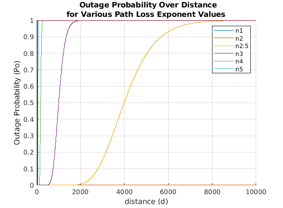
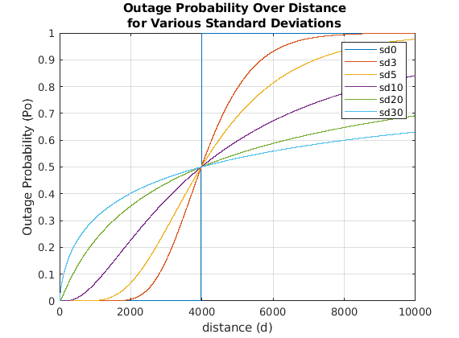
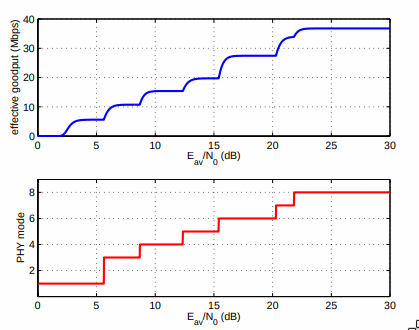
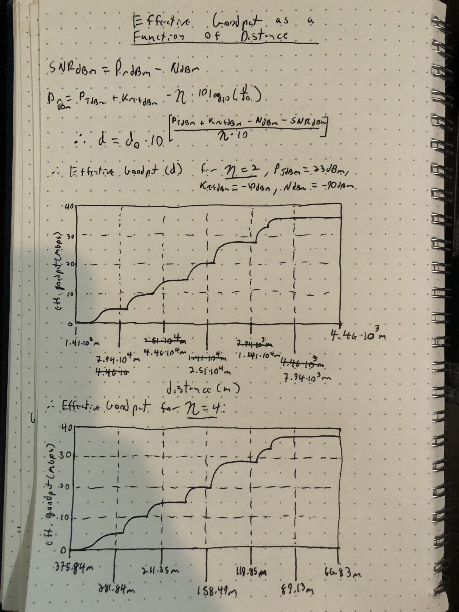

# ee597-assignment2
determining outage probability as a function of distance for log-normal shadowing, rate adaption for varying ranges of SNR, and modeling Rayleigh Fading as a two-state markov chain.

## Outage Probability as a function of distance for Log-Normal Shadowing 

We can see that the probability of outage sigmoid function gets skewed left as we increase the value of the path loss exponent (PLE). This means that the probability of outage increases exponentially by a greater factor when the PLE is increased. This makes sense, as the PLE represents the attenuation due to the nature of the environment (heta > 2 : loss, heta = 2 : vacuum, or no loss, heta < 2 : gain).

We can see that the probability of outage sigmoid function gets shallower as the standard deviation of the path loss exponenent (PLE) increases. This makes sense, as the probability of outage is inversely proportional to the log of the PLE's standard deviation.

## Rate Adaptation

In this exercise, we converted SNR to distance with a known path loss model. PTdBm = 23dBm, Pref = -10dBm, NdBm = -90dBm. We took figure 3 and converted the model from Goodput vs SNR to Goodput vs Distance (m) with heta values 2 and 4.
Here is a breakdown of the SNR --> d(m) conversions for clarity:
d = d0 * 10(PTdbm + Pref - NdBm - SNRdBm)/(heta * 10)

heta = 2:\  
d(SNR = 0)  = 1.41E5m\  
d(SNR = 5)  = 7.94E4m\  
d(SNR = 10) = 4.46E4m\  
d(SNR = 15) = 2.51E4m\  
d(SNR = 20) = 1.41E4m\  
d(SNR = 25) = 7.94E3m\  
d(SNR = 30) = 4.46E3m\  

heta = 4:

d(SNR = 0)  = 375.84m
  
d(SNR = 5)  = 281.84m\  
d(SNR = 10) = 211.35m\  
d(SNR = 15) = 158.49m\  
d(SNR = 20) = 118.85m\  
d(SNR = 25) = 89.13m\  
d(SNR = 30) = 66.83m\  

## Rayleigh Fading
In this exercise, we generated Markov Chain models to represent the likelihood that a receiver is in the state of "receive" or "outage." The Markov Chain models and their probabilities are associated with received power (in dBm) being above or below a threshold, dictating whether the received signal is strong enough to demodulate or not. We generated 6 models corresponding to mobile speeds [0, 5, 10, 15, 20, 25]. 
p00 - *the probability that we remain in the "outage" state*
p01 - *the probability that we move from the "outage" state to the "receive" state*
p10 - *the probability that we move from the "receive" state to the "outage" state*
p11 - * the probability that we remain in the "receive" state*

mobile speed = 0:

p00 = 0.0780\  
p01 = 0.1400\  
p10 = 0.1395\  
p11 = 0.6420\  

mobile speed = 5:\  
p00 = 0.0775\  
p01 = 0.1490\  
p10 = 0.1490\  
p11 = 0.6240\  

mobile speed = 10:\  
p00 = 0.0715\  
p01 = 0.1430\  
p10 = 0.1425\  
p11 = 0.6425\  

mobile speed = 15:\  
p00 = 0.0655\  
p01 = 0.1570\  
p10 = 0.1575\  
p11 = 0.6195\  

mobile speed = 20:\  
p00 = 0.0750\  
p01 = 0.1420\  
p10 = 0.1420\  
p11 = 0.6405\  

mobile speed = 25:\  
p00 = 0.0810\  
p01 = 0.1485\  
p10 = 0.1485\  
p11 = 0.6215\  
